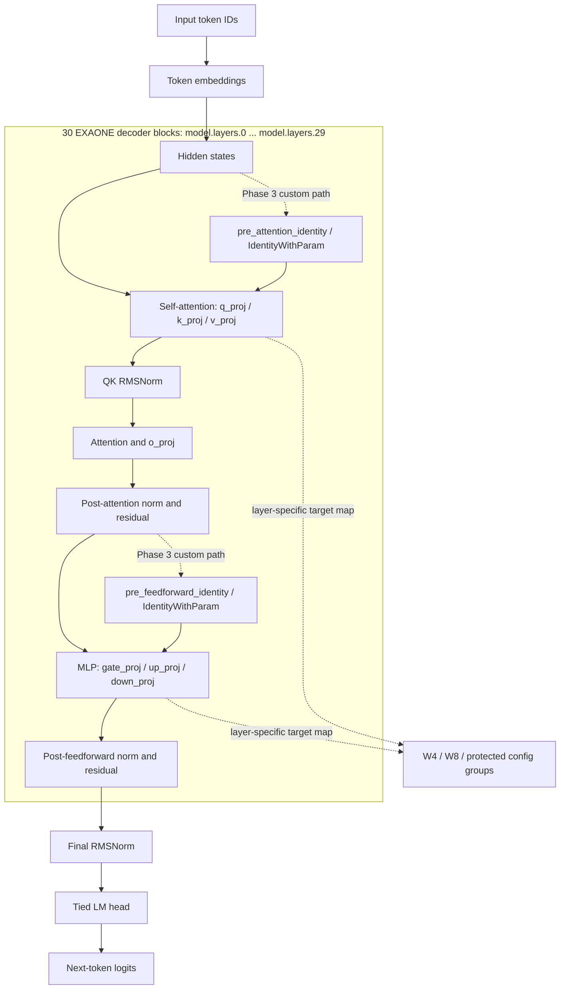

# LG Aimers: EXAONE 4.0 1.2B Quantization and vLLM Optimization

A competition-driven study of how to quantize, adapt, and serve [EXAONE 4.0 1.2B](https://huggingface.co/LGAI-EXAONE/EXAONE-4.0-1.2B) under private evaluation constraints.

The project began as model-side compression work and expanded into runtime engineering. Across Phase 2 and the Phase 3 final-stage track, the central problem was to preserve useful output quality while reducing model size and inference cost, then make the resulting artifact work in a vLLM evaluation environment.

> **Evidence boundary.** Competition rank values and the numeric score weightings below come from internal postmortem records and are not presented as organizer-verified results. Local benchmarks are not competition scores. See [docs/project-status.md](docs/project-status.md) for the claim table.

## 1. Target Model: EXAONE 4.0 1.2B

- **Model card:** [LGAI-EXAONE/EXAONE-4.0-1.2B](https://huggingface.co/LGAI-EXAONE/EXAONE-4.0-1.2B)
- **Architecture family:** `Exaone4ForCausalLM`
- **Inference shape recorded in a reviewed experiment configuration:** 30 decoder blocks, hidden size 2048, intermediate size 4096, 32 query heads, 8 KV heads, 64-dimensional heads, 65,536-token context, SiLU MLP, and tied embeddings.

| Component | EXAONE-specific implication for this project |
|---|---|
| QK RMSNorm | Q/K projection handling and layer mapping could not be assumed to follow Llama-oriented paths unchanged. |
| 32 query heads / 8 KV heads | Grouped-query attention and KV-related quantization experiments had to respect the actual projection layout. |
| 30 decoder blocks | Quantization decisions could be made by block index rather than uniformly for every layer. |
| Tied embeddings | `embed_tokens` and `lm_head` needed explicit protection/exclusion decisions; duplicating this weight was a size risk. |
| Post-norm path | SmoothQuant-style integration had to preserve EXAONE's decoder behavior and checkpoint naming/loading rules. |

### Model Structure and Quantization Targets



The main model-side customization was **not** a claim that EXAONE's base 30-block architecture was replaced. Instead, experiment configurations selected individual `model.layers.<index>` attention and MLP projections for W4, W8, or protection rules. The Phase 3 custom vLLM path added parameterized hidden-state scaling modules before attention and MLP computation; it did not add extra Transformer decoder blocks.

More precise architecture and loader details are in [docs/model-architecture.md](docs/model-architecture.md).

## 2. Common Quantization and Compression Experiments

The project explored a broad search space rather than a single PTQ recipe. The table separates methods with direct local/Notion evidence of attempts from techniques that were researched or feasibility-checked during the Phase 3 search.

### Attempted or Locally Documented Tracks

| Method family | Schemes, configurations, or combinations documented in the project |
|---|---|
| **GPTQ** | W4A16, W8A16, W8A8, W4A8; block-size and group-size sweeps; calibration-set/size sweeps; input-activation variants; sparse 2:4; KV-related variants; front/late-layer and selective-module precision; `down_proj`/`o_proj` protection. |
| **AWQ** | W4A16, W8A16, W4A8, W8A4, W8A8; tensor/sequence-length variants; target-module maps; config groups; `lm_head`/`embed_tokens` exclusions; calibration and internal-parameter sweeps. |
| **SmoothQuant combinations** | SQ + GPTQ, SQ + AWQ, SQ + INT8/FP8, and Pre-Identity-style scaling paths; EXAONE layer-map and vLLM compatibility were investigated. |
| **OmniQuant** | EXAONE/vLLM adaptation work around LET, LWC, calibration, group size, learning rate, AMP behavior, activation scale/shift, packed representation, and runtime compatibility. |
| **Rounding and low-bit methods** | AutoRound W4A16 and KV variants; RTN/RTN-XK; HQQ W4A16/W8A16; GGUF/GGML Q4; INT4 and INT8 tracks. |
| **Advanced numeric formats** | FP8, FP8 dynamic, FP8 block, NVFP4, and mixed INT8/FP8 layer-ratio experiments. |
| **Mixed precision and structure-aware compression** | FP16 skip, W4/W8 layer or module mixes, protected modules, layer drop/drop-last, block distillation, knowledge distillation, and sparse 2:4. |
| **Fine-tuning path** | LoRA, short/deep/phase dataset variants, CoT-oriented data construction, answer-format normalization, token-length filtering, and post-fine-tuning quantization. |

### Researched or Feasibility-Checked Tracks

The Phase 3 investigation also covered ZeroQuant, OWQ, SpQR, SqueezeLLM, Slim-LLM, TurboQuant, SpinQuant, QuaRot, DuQuant, PrefixQuant, LRQuant, QuIP, VPTQ, PT2-LLM, OneBit, MPPQ, and APTQ. Their public status varies by method: some were reviewed for vLLM/Hugging Face/LLM Compressor feasibility, while others reached local exploratory work. They are not all claimed as completed submission methods.

Detailed method evidence, including failed and partial work, is maintained in [docs/technical-inventory.md](docs/technical-inventory.md) and [docs/experiments.md](docs/experiments.md).

## 3. Phase 2: Checkpoint Optimization Under Organizer Runtime

The official [Phase 2 competition page](https://dacon.io/competitions/official/236673/overview/description) frames the task as optimizing `EXAONE-4.0-1.2B` for lightweight inference and submitting final model weights for hidden evaluation. In this project, Phase 2 was the checkpoint-focused stage: the model had to be compatible with the organizer's vLLM-based runtime, but a participant-customized runtime wheel was not part of the documented submission surface.

| Item | Phase 2 record |
|---|---|
| Submission artifact | Quantized or optimized checkpoint |
| Runtime constraint | Must load and infer in the organizer vLLM environment; runtime customization was not part of this project's Phase 2 path |
| End-to-end time limit | Internal postmortem records a 20-minute limit covering model load, inference, and result parsing |
| Speed measurement | Internal postmortem records per-token inference time on the benchmark dataset, rather than total setup time, as the speed signal reflected in scoring |
| Score weighting | **Unverified internal evaluation record:** `5 x accuracy + 5 x speed` |

### Phase 2 Technical Work

- Started from GPTQ baselines, then broadened to GPTQ schema/hyperparameter sweeps and AWQ.
- Analyzed outliers and layer-wise min/max/mean behavior; late attention outlier candidates motivated selective FP16 or mixed-precision attempts.
- Tested calibration data, sequence length, activation handling, group/block size, protected modules, and target-layer maps.
- Added LoRA fine-tuning, data-format normalization, and knowledge-distillation paths once quantization alone appeared insufficient.
- Compared local `lm-eval`-style quality signals and latency-oriented measurements, while documenting that they did not reliably predict the private evaluation result.

## 4. Phase 3 (Final Stage): Custom vLLM Engine and Model-Path Work

The official [Phase 3 competition page](https://dacon.io/competitions/official/236689/overview/description) adds a model-engine submission surface, including a vLLM wheel, and includes code review. That changed the work from checkpoint-only optimization to checkpoint-plus-runtime integration.

| Item | Phase 3 record |
|---|---|
| Submission artifact | Quantized checkpoint plus a custom vLLM wheel/model-engine artifact |
| End-to-end time limit | Internal postmortem records a 30-minute limit covering model load, inference, and result parsing |
| Speed condition | Internal postmortem records a timeout condition during benchmark inference |
| Score weighting | **Unverified internal evaluation record:** `60 x accuracy + 20 x speed + 20 x model size` |
| Competition progression | Internal project record describes earlier-phase passage and participation in the Phase 3 final-stage track; it is not a verified prize or leaderboard claim. |

### vLLM Customization: Model Registration and Hidden-State Modules

The custom runtime work went beyond an external vLLM invocation. Reviewed project-fork commits and the corresponding Notion code export show the following EXAONE-specific path:

1. Registered `Exaone4ForCausalLMSQ` as a vLLM model path, with checkpoint configuration expected to identify that architecture.
2. Created `Exaone4DecoderLayerWithPreIdentity`, a custom decoder-layer implementation for the SmoothQuant path.
3. Added an `IdentityWithParam` module with a learnable per-channel `smooth_factor` of length `hidden_size`.
4. Applied `pre_attention_identity` before self-attention and `pre_feedforward_identity` before the MLP in each custom decoder block.
5. Preserved the post-attention and post-feedforward norms while handling the original checkpoint's `input_layernorm` weights according to the custom loader path.
6. Investigated EXAONE registration and LET/LWC-oriented OmniQuant adaptation, vLLM quantization-config parsing, and CUDA-kernel/config work as internal implementation efforts.

The critical distinction is architectural: these are **new hidden-state scaling modules inside the custom decoder path**, not extra Transformer blocks or an unsupported claim of ownership of vLLM/SmoothQuant. The implementation evidence is linked in [docs/source-map.md](docs/source-map.md); the full vLLM tree is intentionally excluded.

## Repository Guide

```text
docs/          Competition rules, architecture, experiments, evidence, and safety
techniques/    Future method-specific notes with evidence and attribution
configs/       Future sanitized configuration examples
experiments/   Future sanitized manifests and local benchmark summaries
patches/       Small license-reviewed patch references only
scripts/       Future cleaned helpers without private paths, data, or credentials
```

- [Competition overview](docs/competition-overview.md): Phase rules, evaluation boundary, and result terminology.
- [Model architecture](docs/model-architecture.md): EXAONE structure, target modules, and the custom vLLM decoder path.
- [Technical inventory](docs/technical-inventory.md): full technique classification and source levels.
- [Experiments](docs/experiments.md): attempted, partial, failed, local, and official-result policy.
- [Source map](docs/source-map.md): upstream attribution and the public include/exclude manifest.

## Public Safety and Attribution

This repository excludes DACON tokens, private datasets, generated JSONL, checkpoints, tokenizer/model artifacts, submission files, wheels, raw Notion exports, notebook outputs, local caches, and full vLLM/OmniQuant source trees. The DACON token found in the original workspace must be revoked or rotated before any related history is shared.

vLLM, OmniQuant, GPTQ, AWQ, and other methods/frameworks remain attributed to their original authors. This repository claims only the evidence-backed EXAONE-specific analysis, experiment design, runtime integration, selected custom model-path changes, and documentation.
