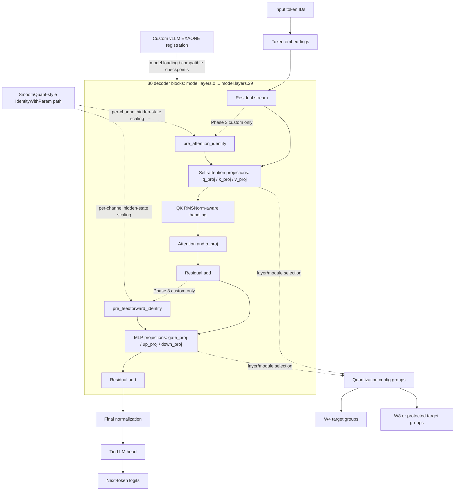

# EXAONE 4.0 1.2B Architecture and Layer Mapping

## Reference Model

The target model is [LGAI-EXAONE/EXAONE-4.0-1.2B](https://huggingface.co/LGAI-EXAONE/EXAONE-4.0-1.2B), an instruction-tuned causal language model. The architecture map below is based on a reviewed configuration associated with a local EXAONE quantization experiment and is used here to explain the targeting and integration work. The raw model/configuration artifacts are intentionally not included.

| Configuration field | Recorded value | Why it mattered |
|---|---:|---|
| Architecture | `Exaone4ForCausalLM` | Needed an EXAONE-aware loading/registration path |
| Decoder blocks | 30 | Made layer-indexed targeting and mixed precision possible |
| Hidden size | 2048 | Defines attention and residual-stream width |
| MLP intermediate size | 4096 | Defines gate/up/down projection sizes |
| Query heads | 32 | Attention projection and reshape compatibility |
| KV heads | 8 | Grouped-query attention mapping and KV-related experiments |
| Head dimension | 64 | Consistent with hidden-size/head-count layout |
| Context length | 65,536 | Sequence-length and calibration choices needed to be explicit |
| Activation | SiLU | MLP behavior relevant to quantization error |
| Embeddings | Tied | Protected-module decisions had to account for `lm_head`/embedding linkage |

## Structural View

## Layer-Specific Quantization Configuration

The important project customization was not a claim that the base 30-layer EXAONE architecture itself was redesigned. Instead, reviewed local experiment configuration shows **per-layer and per-module target selection**:

- `model.layers.<index>.self_attn.q_proj`, `k_proj`, and `v_proj` could be targeted differently by layer.
- `model.layers.<index>.mlp.gate_proj`, `up_proj`, and `down_proj` could be targeted differently by layer.
- One reviewed configuration used multiple packed quantization groups: W4 groups with group size 128 and a separate W8 group for selected targets.
- The selected targets were not uniform across all 30 blocks; some projection/layer combinations were deliberately omitted, protected, or assigned a different format.
- `lm_head` and embedding treatment remained a separate protected-module decision because the model uses tied embeddings.

This configuration-level layer mapping is the basis for the repository's references to hidden-layer selection, mixed precision, front/late-layer variants, and module protection. It should be described as a **quantization targeting strategy**, not as a modification of EXAONE's published base dimensions.

## vLLM Customization Boundary

Reviewed public commits in the project vLLM fork provide implementation evidence for:

- registering an `Exaone4ForCausalLMSQ` model path;
- creating `Exaone4DecoderLayerWithPreIdentity` for the custom EXAONE decoder path;
- adding `IdentityWithParam`, a per-channel learnable `smooth_factor`, before self-attention and before the MLP in each custom decoder layer;
- retaining post-attention and post-feedforward RMSNorm while the custom loader skips the original `input_layernorm` weights; and
- aligning an expected smooth-factor parameter name with checkpoint weights.

These are hidden-state scaling modules in the existing decoder path. They are not additional Transformer decoder blocks and do not establish ownership of vLLM or SmoothQuant. The full vLLM tree is not copied here; see [source-map.md](source-map.md) for commit links and attribution.

## Public Artifact Policy

Potential future public files may include a small, license-reviewed patch or a sanitized configuration example. The raw quantized checkpoint configuration, model weights, tokenizer artifacts, and wheel files remain excluded because they are model/submission artifacts rather than portable documentation.
